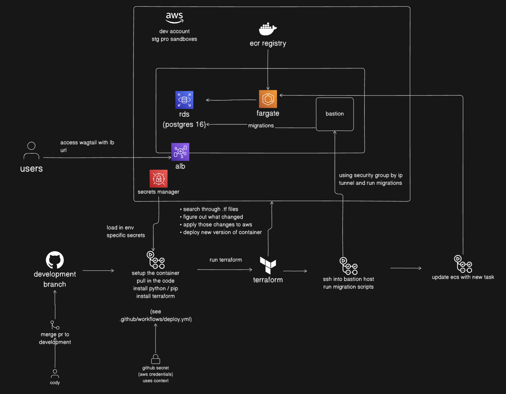
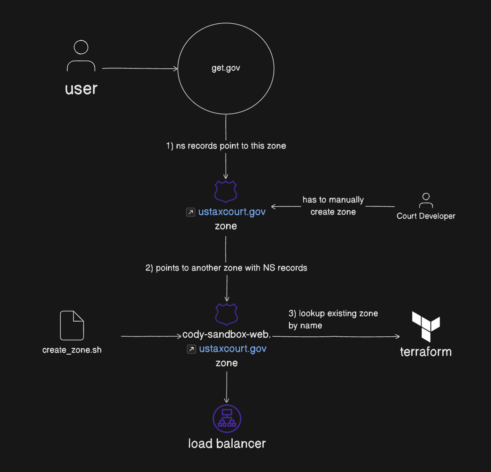

# Overview

This repository contains the code for [ustaxcourt.gov](https://ustaxcourt.gov).  It is a wagtail website deployed to AWS. You can access the deployed environments at the following URLs:

- [Development](https://dev-web.ustaxcourt.gov)
- [Test](https://test-web.ustaxcourt.gov)

Note, we plan to get sub domains for these environments, and these links are subject to change for now.  Also, until we get the domains, they will be non https (so not secure).

# Running the Wagtail Website

There are a number of make commands to run the service locally. See Makefile for more details. To simply run the app, run the following commands in your terminal from the website-wagtail directory:

### Pre-reqs

#### Setup PyEnv

```
brew install pyenv
cd website
pyenv install
```

#### Setup aws cli

```
brew install awscli
```

#### Setup Ruff

```
brew install ruff
```

#### Setup Pre-Commit

Before you commit to the repo, we run some checks to verify and fix the formatting of python.

```
brew install pre-commit
pre-commit install # do this at project root
```

### Setup development environment.

```shell
make setup
```

### Checks

```shell
make check
```

### Data/Model migrations.

First run `makemigrations` to generate the data model changes.

```shell
make makemigrations
```

If there are changes detected, run `migrate` to apply the changes to database:

```shell
make migrate
```

### Setting up superuser to login.

```shell
make superuser
```

If admin superuser already exists, you can use it as is or reset the password to default using:

```shell
make resetadminpassword
```

### Run

Finally, running applicaiton.

```shell
make run
```

## Default Admin Account
- Default username: admin
- Default password: ustcAdminPW!

See `make superuser` to see how it is setup first time.

# The Developer Sandbox AWS Account

## Getting AWS Credentials

Mike will reach out to you with a aws console username & password. Please verify you can login with it, and also reach out to have your default password changed because you can't do it in the console from what we've seen.

Next, you'll want to make sure your application is setup with your sso. You should be able to run this command and enter your SSO url when prompted. You'll also be promted with some other stuff you want to fill in.

- `aws sso configure`

If you want to manually refresh your token which should last 8 hours, run this command

- `aws sso login --profile sandbox`

## Deploying to your Sandbox

If you want to deploy the application to your sandbox, follow these steps:

### Prereqs:

Use make command `make aws-setup` to complete the necessary aws infra setup. It does the following steps that can be performed manually too.

- generate your private and public key pairs needed to remote into the bastion host
  - `mkdir -p .ssh && ssh-keygen -f .ssh/id_rsa` (generate the ssh key used for the bastion host)
  - `cat .ssh/id_rsa | base64 | tr -d '\n' > .ssh/id_rsa.base64` (generate a base64 of the private key - used for bastion)
  - `cat .ssh/id_rsa.pub | base64 | tr -d '\n' > .ssh/id_rsa.pub.base64` (generate a base64 of the public key - used for bastion)
- update the `deploy.yml` Set Environment task branch logic to map your sandbox branch name to an environment prefix
- push code to your sandbox branch, `cody-sandbox`
- login to your sandbox aws account and create a secret in aws secrets manager called `website_secrets` in `us-east-1`
  - it needs a `DATABASE_PASSWORD` set before you can run terraform.
  - it also needs `BASTION_PUBLIC_KEY` (see step 1 and 2 below on how it's generated)
  - also set `BASTION_PRIVATE_KEY`, this is used by circle to ssh into the bastion host
  - set `SUPERUSER_PASSWORD`, used to initialize wagtail with a superuser called `admin`
  - set `SECRET_KEY`, used by django (`python3 -c 'from django.core.management.utils import get_random_secret_key; print(get_random_secret_key())'`)
  - set `DOMAIN_NAME` which should be the domain name you want to use for your sandbox environment, i.e. `something.ustaxcourt.gov` (or in prod `ustaxcourt.gov`)
- create an iam `deployer` user
  - attach policies directly, create a new policy called `deployer-policy`, paste in the `deployer-policy.json`
  - attach the new policy to your user
  - create an access key for that user, choose cli option
  - copy those keys for the next step
- create a github action context with the same name of your branch `cody-sandbox`
  - `AWS_ACCESS_KEY_ID`
  - `AWS_SECRET_ACCESS_KEY`

Now you can push changes to your sandbox branch and it'll auto deploy using github actions.

## Caveats

If you run a terraform init with your sandbox account, but then try to run it again for another account, remember to delete the infra/.terraform directory otherwise you'll run into state issues. After deleting that directory, terraform will reconfigure the backend state from s3 to your local machine instead of re-using the existing local state file.

## Destroying your Sandbox

Leaving your sandbox running without being used will waste money.  Remember to clean it up with the following steps:

1. `cd infra`
2. manually disable delete protection for your rds database in file [rds.tf](./infra/modules/rds.tf)
3. modify `rds.tf` to remove the lifecycle rule preventing the destruction of the rds instance
4. `ENVIRONMENT=<SANDBOX ENV> ./destroy.sh` or run `make destroy`


## Manually Connecting to DB

Because the RDS instance is behind a VPS, that means you will need to setup an SSH tunnel through a bastion host to be able to access it.

`ssh -L 5432:<RDS_HOSTNAME>:5432 -N -i .ssh/id_rsa ubuntu@<IP_ADDRESS>`

after running this in a separate terminal, you should be able to run migrations or connect directly using tableplus.


## CI / CD

Our code is currently deployed using github actions when your pull request is merged to the `development` branch.  The way this works, is the github action will spin up an ubuntu machine, pull in the branch code, setup python and terraform, and eventually it'll run terraform which will build the wagtail container, and deploy that container to aws ecs.  After updating our infrastructure, the ci/cd pipeline will run migration scripts via the bastion host tunnel which will update the ecs service with the latest wagtail migration scripts.  Finally, the github action workflow will update the ECS task to run with the latest version of the wagtail container.

The application is publically accessible via an AWS ALB which points to ECS.



## Route53 Setup

The domains are setup using Route53.  It's good to know that there is a service called get.gov which is a registrar used by the us government for setting up domains.  The Tax Court domain of ustaxcourt.gov is registered through get.gov, and they have a NS record setup to point to a route53 zone inside of the ustaxcourt.gov aws account.  That AWS account then points to the route53 zone in our various sandbox and production accounts.

Note: Jim or someone on the tax court is responsible for adding those NS records manually to their aws account.  See the diagram below for more details.




## Updating the Deployer Policy

The deployer policy is setup in the aws account using the `update_aws_policy.sh` script.  This script will get the aws account id and use that to update the policy in the aws account.  It will also update the policy in the `deployer-policy.json` file.

```shell
./update_aws_policy.sh
```

# Pull Request Workflow

This document clarifies the process a developer should follow when assigned to an issue/story.

## Summary

Generally speaking, this project will follow a [feature-branch workflow](https://www.atlassian.com/git/tutorials/comparing-workflows/feature-branch-workflow):
-  `main` branch represents the official project history, and the starting point for all story work
- developers work on stories by branching off of `main`, implementing their work in a feature branch, and ultimately integrating their feature branch back into `main` once their work is complete

Additionally, we will use tags to facilitate deployment to production and sandbox instances.

**Sandbox Environment Configuration**

Each developer needs to configure and maintain a test environment for new features. Currently, your AWS sandbox account serves as this environment. If you have not configured your sandbox account yet, follow these steps:

1. **Log in to your AWS sandbox account**, export the account keys, and configure them as your current AWS environment on your laptop (copy and paste the export commands into your shell console and use this console for remaining steps).

2. **Check out the `main` branch** of the repository.

3. **From the repository’s root directory**, run:
   ```shell
   make aws-setup
   ```
   This command creates the necessary `website_secrets` in your AWS sandbox environment.

4. **Confirm your `DOMAIN_NAME`.** Log in to your AWS sandbox account and check the secret entry under `website_secrets`. It might be `{developer-name}-sandbox-web.ustaxcourt.gov`. If you want to change the domain name, do it now.

5. **Configure github sandbox environment** Open file "infra/iam/sandbox_generated-deployer-access-key.json" and provide "AccessKeyId" and the "SecretAccessKey" values to [@jtdevos](https://github.com/jtdevos)/admin for github environment configuration. a new environment with "github user_sandbox" will be created.

6. **Push `sandbox` tag to setup your sandbox environment**. In your laptop console, run the following command to create a deployment workflow in GitHub to start the application deployment workflow:
   ```shell
   make tag tag=sandbox
   ```
   Monitor the deployment under [Actions > Deploy](https://github.com/ustaxcourt/website-wagtail/actions/workflows/deploy.yml). The workflow will pause on a Terraform step (`module.app.aws_acm_certificate_validation.main: Still creating... [X elapsed]`). The entire deployment will complete after you provide NS entries to [@jtdevos](https://github.com/jtdevos). See next step.

7. **While the github workflow is in progress.** Log in to your AWS sandbox admin console, go to [Route53 > Hosted Zones](https://us-east-1.console.aws.amazon.com/route53/v2/hostedzones?region=us-east-1), and open the link for `"{{DOMAIN_NAME}}"`. Copy the “Value/Route traffic to” entries for the `"NS"` record. They might look like this:
   ```text
   ns-1396.awsdns-46.org.
   ns-886.awsdns-46.net.
   ns-1560.awsdns-03.co.uk.
   ns-341.awsdns-42.com.
   ```

8. **Provide the `NS` entries and "Record name" (`DOMAIN_NAME`)** to [@jtdevos](https://github.com/jtdevos). After Jim configures the routing, the deployment workflow should complete successfully.

9. **Open the `DOMAIN_NAME`** in your browser to verify that the website is functioning correctly.

10. **Destroy application environment**. Verify you are able to destory the application environment by running destory command.

> [!WARNING]
> Leaving your sandbox application environment running might incur unwanted expense. Once the testing is done, you should destroy the AWS resources.

```shell
make tag tag=sandbox-destroy
```

## The Workflow
1. Pick up a story on the main board,
2. Create feature branch that includes the Monday.com story ID e.g. `[type]/[brief-description]-[monday-id]`
    - `type`: the value of the **Type** column in Monday.com
    - `brief-description`: a few words to describe the purpose of the branch
    - `monday-id`: the valu of the **Item ID** in Monday.com
3. Develop and test locally
4. When ready for review, push branch to github (if not done already) and create a draft PR to `main`
5. Deploy your feature to your sandbox by tagging your feature branch with `sandbox` , e.g.
```shell
    make tag tag=sandbox
```
Or, the following equivalent command.
```shell
    git tag -f sandbox
    git push -f origin sandbox
```
> Additionally, you can add/reassign tags using the Github website.

6. Developer notifies team that feature is ready for review:
  - by moving the story card in Monday.com to the `Watiting for review` lane, and
  - by notifying the stakeholders (UX, PO) in Teams that the feature is ready for testing.
7. UX verifies AC in sandbox
8. PO verifies AC in sandbox
9. Take your PR out of draft and request reviews
> If a code review results in significant changes to the feature, deploy an update to the developer sandbox and request a re-review from UX and PO
10. Once everything looks good (PR reviewed, UX+PO approval), merge the PR (thus integrating the feature into `main`)
11. Once merged, a github automation will deploy the current state of `main` to the staging environment.
