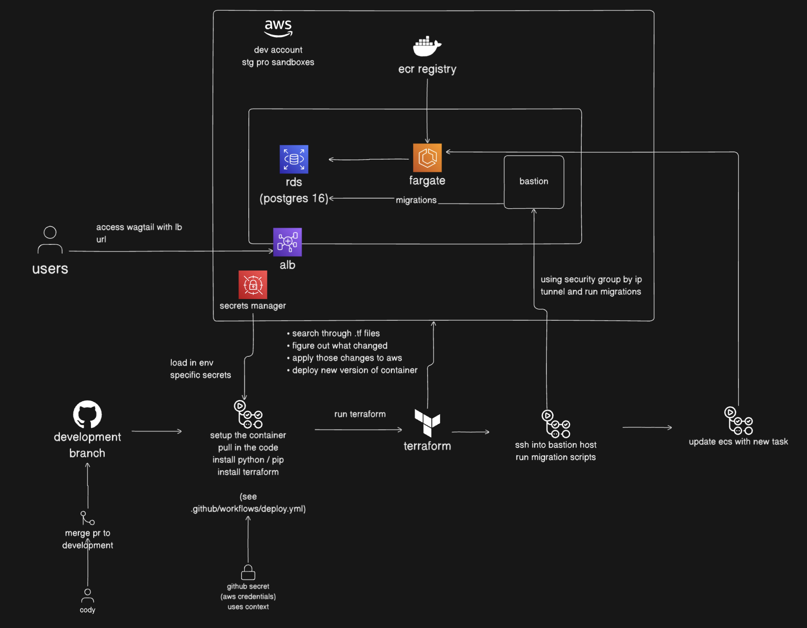
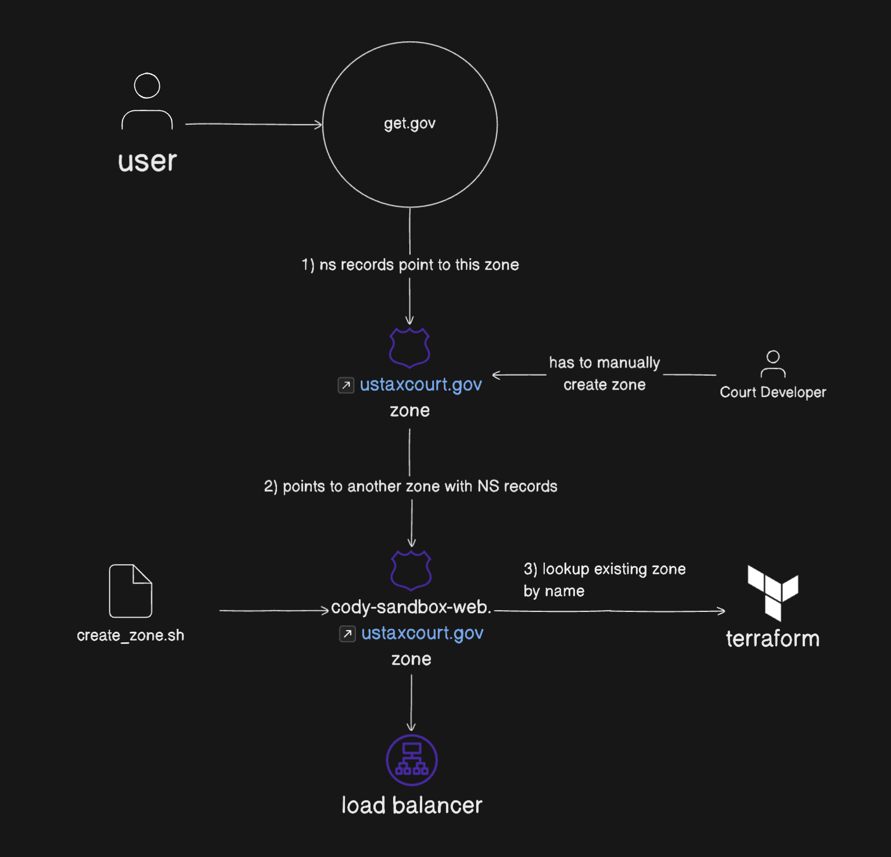

# Overview

This repository contains the code for [ustaxcourt.gov](https://ustaxcourt.gov).  It is a wagtail website deployed to AWS. You can access the deployed environments at the following URLs:

- [Development](https://dev-web.ustaxcourt.gov)

Note, we plan to get sub domains for these environments, and these links are subject to change for now.

## Running the Wagtail Website

There are a number of make commands to run the service locally. See Makefile for more details. To simply run the app, run the following commands in your terminal from the website-wagtail directory:

### Pre-reqs

#### For Windows Laptops (WSL + VS Code)
- Open PowerShell and run:
  - `wsl --install`
- Add the Remote – WSL extension (Search for "WSL" and install the Remote - WSL extension by Microsoft.)
- In WSL terminal:
  - `sudo apt update`
  - `sudo apt install git`
- In WSL terminal: Navigate to your home directory and create a project folder:
  - `cd ~`
  - `mkdir -p projects`
  - `cd ~/projects`
  - `git clone <repo-url>`
  - `cd website-wagtail/`
  - `code .`  # opens project in VS Code (WSL mode)

> **Note:** After opening the project in VS Code (WSL), follow the same setup instructions as for Mac/Linux below (installing pyenv, Node, AWS CLI, etc.) inside your WSL terminal. You can use `apt` or install `brew` in WSL to manage dependencies as preferred.

We will use `brew` to install all necessary software for a Mac laptop. To start ensure you have installed brew.

```shell
/bin/bash -c "$(curl -fsSL https://raw.githubusercontent.com/Homebrew/install/HEAD/install.sh)"
```

#### Setup PyEnv

```shell
brew install pyenv
pyenv init
cd website
pyenv install
```

#### Setup aws cli

```shell
brew install awscli
```

#### Setup Node

```shell
brew install node
brew install nvm
```

#### Setup `tfenv`

You will want to install `tfenv` so that you can install and switch to different terraform versions. The current terraform version used in this project is tracked in file [.terraform-version](./.terraform-version). `tfenv install` command installs the version mentioned in that file.

```shell
brew install tfenv
tfenv install
```

#### Setup `pre-commit`

Before you commit to the repo, we run some checks to verify and fix the formatting of python.

```shell
brew install pre-commit
pre-commit install # do this at project root.
```

##### Updating `.secrets.baseline`

If `detect-secrets` flags a value that's a legitimate false positive (e.g. a local
dev fixture or test key), allowlist it by updating the baseline in place:

```shell
detect-secrets scan --baseline .secrets.baseline
```

### Setup development environment.

```shell
make setup
```

### Checks

```shell
make check
```

### Testing

#### Unit tests
```shell
make pytest
```

#### E2E tests (Cypress)
```shell
make test-e2e
```

#### VoiceOver / screen reader tests (Playwright)

These tests use [@guidepup/playwright](https://www.guidepup.dev/) to drive macOS VoiceOver via Playwright and verify that pages are navigable and announced correctly by a screen reader. They are macOS-only.

One-time setup (installs VoiceOver automation permissions):
```shell
make setup-voiceover
```

Run all VoiceOver tests against the local dev server:
```shell
make test-voiceover
```

Run against a different base URL (e.g. a sandbox environment):
```shell
make test-voiceover baseUrl=https://alice-sandbox-web.ustaxcourt.gov
```

Test files live in `website/playwright/tests/`. Each test file mirrors its corresponding Cypress spec and focuses on screen reader announcement order, landmark navigation, and ARIA live region behaviour.

#### E2E tests against AWS lower environments

These commands run Cypress from your local machine against an AWS-hosted environment and pull admin credentials from AWS Secrets Manager using your local `awscli` session.

Prerequisites:

- `awscli` is installed and authenticated (`aws sso login --profile ...` or equivalent)
- `jq` is installed
- The target environment has a `website_secrets` secret with one of:
  - `CYPRESS_ADMIN_PASSWORD`
  - `ADMIN_PASSWORD`
  - `DJANGO_SUPERUSER_PASSWORD`

Examples:

```shell
# Run against dev-web
make test-e2e-aws aws_env=dev-web

# Run against train-web and include admin validation specs
make test-e2e-aws aws_env=train-web args=include-admin

# Run against the logged-in sandbox account's DOMAIN_NAME from website_secrets
make test-e2e-aws aws_env=sandbox

# Optional override for a specific sandbox URL pattern: https://alice-sandbox-web.ustaxcourt.gov
make test-e2e-aws aws_env=sandbox sandbox_name=alice

# Run against any explicit URL
make test-e2e-aws base_url=https://my-custom-env.ustaxcourt.gov

# Open interactive Cypress runner against AWS env
make cypress-open-aws aws_env=dev-web
```

Optional arguments for `test-e2e-aws` and `cypress-open-aws`:

- `secret_id` (default: `website_secrets`)
- `region` (default: `AWS_DEFAULT_REGION` or `us-east-1`)
- `browser` (default: `chrome`)
- `spec` (optional Cypress spec glob)
- `skip-health-check` (optional flag; bypasses the preflight URL check when you intentionally want Cypress to run without endpoint health validation)

To store dedicated Cypress admin credentials in `website_secrets` without putting the password in command history:

```shell
ADMIN_USERNAME=admin make aws-cypress-set-credentials
```

You will be prompted securely for the password. You can still use `ADMIN_PASSWORD` if needed for non-interactive workflows.

Artifacts from each run are copied to:

```text
website/cypress/artifacts/<aws_env-or-custom>/<YYYYMMDD-HHMMSS>/
```

Each artifact folder includes screenshots/videos/downloads (when present) and a `metadata.txt` file with run details.

Admin-related Cypress tests read credentials from `cypress.env.json` (gitignored). This file is auto-generated with local defaults when you run `make setup` or `make reset`. To use different credentials, edit `website/cypress.env.json` directly — it will not be overwritten once it exists.

```json
{
  "ADMIN_USERNAME": "admin",
  "ADMIN_PASSWORD": "ustcAdminPW!"
}
```

In GitHub Actions, credentials are supplied via the `CYPRESS_ADMIN_USERNAME` and `CYPRESS_ADMIN_PASSWORD` **repository secrets** (set once under *Settings → Secrets and variables → Actions → Repository secrets* — not per-environment).

### Data/Model migrations.

First run `makemigrations` to generate the data model changes.

```shell
make makemigrations
```

If there are changes detected, run `migrate` to apply the changes to database:

```shell
make migrate
```

### Setting up superuser to login.

```shell
make superuser
```

If admin superuser already exists, you can use it as is or reset the password to default using:

```shell
make resetadminpassword
```

### Run

Finally, running application.

```shell
make run
```

## Default Admin Account
- Default username: `admin`
- Default password: `ustcAdminPW!`

See `make superuser` to see how it is setup first time.

# The Developer Sandbox AWS Accounts

## Getting AWS Credentials

Mike will reach out to you with a aws console username & password. Please verify you can login with it, and also reach out to have your default password changed because you can't do it in the console from what we've seen.

Next, you'll want to make sure your application is setup with your sso. You should be able to run this command and enter your SSO url when prompted. You'll also be prompted with some other stuff you want to fill in.

   ```
   aws configure sso
   ```

Your `sso_start_url` value will be provided to you by an admin. For the other values, use:

- *SSO Session Name*: something memorable, e.g. `ustc-sso`
- *sso_region*: `us-east-1`
- *sso_registration_scopes*: `sso:account:access`

If you want to manually refresh your token which should last 8 hours, run this command

- `aws sso login --profile sandbox`

## Sandbox Environment Configuration

Each developer needs to configure and maintain a test environment for new features. Currently, your AWS sandbox account serves as this environment. If you have not configured your sandbox account yet, follow these steps:

1. **Log in to your AWS sandbox account**, export the account keys, and configure them as your current AWS environment on your laptop (copy and paste the export commands into your shell console and use this console for remaining steps).

> [!IMPORTANT]
> You should add an account alias to your AWS Sandbox account. It should end with `-sandbox`, a good alias would be: `ustc-username-sandbox`. See [IAM console](https://docs.aws.amazon.com/IAM/latest/UserGuide/account-alias-create.html#w5aab9c19c19b7) section for "To create an AWS account alias".

To check whether you have successfully logged into your account and that the proper environment variables are set, run the following:
   ```
   . infra/get_env.sh
   ```
   This should return the value `sandbox`.  If not, revisit the previous steps or ask someone on the team for help before moving forward.

2. **Check out the `main` branch** of the repository.

3. **From the repository’s root directory**, run:
   ```shell
   make aws-setup
   ```
   This command creates the necessary `website_secrets` in your AWS sandbox environment.

4. **Confirm your `DOMAIN_NAME`.** Log in to your AWS sandbox account and check the secret entry under `website_secrets`. It might be `{developer-name}-sandbox-web.ustaxcourt.gov`. If you want to change the domain name, do it now.

5. Populate required values for the `website_secrets` secret:
    - `DJANGO_SUPERUSER_PASSWORD`: Choose a unique, non-trivial password.
    - SSO-related values (receive these from an USTC Admin)
      - `SOCIAL_AUTH_AZUREAD_TENANT_OAUTH2_KEY`
      - `SOCIAL_AUTH_AZUREAD_TENANT_OAUTH2_SECRET`
      - `SOCIAL_AUTH_AZUREAD_TENANT_OAUTH2_TENANT_ID`

6. **Configure github sandbox environment** Open file "infra/iam/sandbox_generated-deployer-access-key.json" and provide "AccessKeyId" and the "SecretAccessKey" values to [@jtdevos](https://github.com/jtdevos)/admin for github environment configuration. a new environment with "github user_sandbox" will be created.

```text
github environment name: {{github_user_id}}_sandbox
AWS_ACCESS_KEY_ID: AccessKeyId
AWS_SECRET_ACCESS_KEY: SecretAccessKey
```

7. **Push `sandbox` tag to setup your sandbox environment**.   In your laptop console, run the following command to create a deployment workflow in GitHub to start the application deployment workflow:
> [!IMPORTANT]
> You must choose a unique DJANGO_SUPERUSER_PASSWORD value in secrets manager prior to completing your first deployment.

```shell
   make tag tag=sandbox
```
Monitor the deployment under [Actions > Deploy](https://github.com/ustaxcourt/website-wagtail/actions/workflows/deploy.yml). The workflow will pause on a Terraform step (`module.app.aws_acm_certificate_validation.main: Still creating... [X elapsed]`). The entire deployment will complete after you provide NS entries to [@jtdevos](https://github.com/jtdevos). See next step.

8. **While the github workflow is in progress.** Log in to your AWS sandbox admin console, go to [Route53 > Hosted Zones](https://us-east-1.console.aws.amazon.com/route53/v2/hostedzones?region=us-east-1), and open the link for `"{{DOMAIN_NAME}}"`. Copy the “Value/Route traffic to” entries for the `"NS"` record. They might look like this:
   ```text
   ns-1396.awsdns-46.org.
   ns-886.awsdns-46.net.
   ns-1560.awsdns-03.co.uk.
   ns-341.awsdns-42.com.
   ```

9. **Provide the `NS` entries and "Record name" (`DOMAIN_NAME`)** to [@jtdevos](https://github.com/jtdevos). After Jim configures the routing, the deployment workflow should complete successfully.

10. **Open the `DOMAIN_NAME`** in your browser to verify that the website is functioning correctly.

11. **Destroy application environment**. Verify you are able to destroy the application environment by running destroy command.

> [!WARNING]
> Leaving your sandbox application environment running might incur unwanted expense. Once the testing is done, you should destroy the AWS resources.

```shell
make tag tag=sandbox-destroy
```
## SSO Authentication

### Adding SSO users to sandbox during deployment

You may pre-load your users so that they can login seamlessly with SSO, either as superusers or within an existing group (at time of writing, Editors or Moderators). There are sample values below for each secret. Save to website-secrets in the target environment prior to deployment.

When a user is added for the first time by these scripts, there is no name data associated. That information is updated once the user logs in using SSO for the first time. Note that the script for preregistering users will update roles for existing users listed in the secret and remove any existing superuser status. If the user is also listed in the superuser secret, they will retain any roles applied when they are promoted to superuser.

SUPERUSERS_TO_PREREGISTER:
`
[
  "superuser1@example.com",
  "superuser2@example.com"
]
`

USERS_TO_PREREGISTER:
`
{
  "Editors": [
    "editor1@example.com",
    "john.doe@example.com"
  ],
  "Moderators": [
    "moderator_a@example.com",
    "editor1@example.com"
  ]
}
`

### Configuring SSO
> [!NOTE] This section is intended for USTC Employees with access to the [Microsoft Azure Portal](https://portal.azure.com).

In order for USTC employees & contractors to login to wagtail admin with their Active Directory credentials, a USTC administrator must first register the sandbox URL with the Court's Azure portal and then supply the sandbox with a "SSO Client Secret".

#### How To Register A Wagtail Sandbox Website Using The Microsoft Azure Portal

1.  Login to the [Microsoft Azure Portal](https://portal.azure.com) website

2. Elevate your permissions to "Application Administrator"
	- Go to `All Services > Privileged Identity Management > Tasks > My Roles`
	- Select the "Activate" option for "Application Administrator"

3. Go to: All Services > App Registrations > ustc-website-sso
- Under "all applications, filter to "ustc-website-sso" and select that
- allowlist the redirect urls used by the wagtail instance
  - Select "Manage > Authentication"
  - Select "Add Redirect URI"
  - (If prompted with "select platform", choose "web")
  - Add the following URI's:
    - https://[sandboxname].ustaxcourt.gov/
    - https://[sandboxname].ustaxcourt.gov/complete/azuread-tenant-oauth2/

4. Make note of the OAuth Tenant keys/secrets - your webapp will need them
- Select "Overview" from side menu
- Note the following values - AWS secrets manager will need them.
  - "Directory (tenant) ID"
  - "Application (client) ID"

#### How To Obtain A Unique `SOCIAL_AUTH_AZUREAD_TENANT_OAUTH2_SECRET` For A Sandbox

- activate "Application Administrator" role in PIM
- go to App Registrations > ustc-website-sso > Certificates & secrets
- select "client secrets" and generate a new secret:
  - age: 6 months
  - choose a simple name e.g. "Jim sandbox secret"


## Deploying to your Sandbox

If you want to deploy the application to your sandbox, follow these steps:

### Prereqs:

Use make command `make aws-setup` to complete the necessary aws infra setup. It does the following steps that can be performed manually too.

- generate your private and public key pairs needed to remote into the bastion host
  - `mkdir -p .ssh && ssh-keygen -f .ssh/id_rsa` (generate the ssh key used for the bastion host)
  - `cat .ssh/id_rsa | base64 | tr -d '\n' > .ssh/id_rsa.base64` (generate a base64 of the private key - used for bastion)
  - `cat .ssh/id_rsa.pub | base64 | tr -d '\n' > .ssh/id_rsa.pub.base64` (generate a base64 of the public key - used for bastion)
- push code to your sandbox branch, `cody-sandbox`
- login to your sandbox aws account and create a secret in aws secrets manager called `website_secrets` in `us-east-1`
  - it needs a `DATABASE_PASSWORD` set before you can run terraform.
  - it also needs `BASTION_PUBLIC_KEY` (see step 1 and 2 below on how it's generated)
  - also set `BASTION_PRIVATE_KEY`, this is used by circle to ssh into the bastion host
  - set `DJANGO_SUPERUSER_PASSWORD`, used to initialize wagtail with a superuser called `admin`
  - set `SECRET_KEY`, used by django (`python3 -c 'from django.core.management.utils import get_random_secret_key; print(get_random_secret_key())'`)
  - set `DOMAIN_NAME` which should be the domain name you want to use for your sandbox environment, i.e. `something.ustaxcourt.gov` (or in prod `ustaxcourt.gov`)
  - set `WAGTAILTRANSFER_SECRET_KEY`, used by Wagtail Transfer
  - set `WAGTAILTRANSFER_SOURCES`, used by Wagtail Transfer
- create an iam `deployer` user
  - attach policies directly, create a new policy called `deployer-policy`, paste in the `deployer-policy.json`
  - attach the new policy to your user
  - create an access key for that user, choose cli option
  - copy those keys for the next step
- create a github action context with the same name of your branch e.g. `cody-sandbox`
  - `AWS_ACCESS_KEY_ID`
  - `AWS_SECRET_ACCESS_KEY`

Now you can tag any branch `make tag tag=sandbox` and the code will automatically deploy to your sandbox environment.

## Caveats

If you run a terraform init with your sandbox account, but then try to run it again for another account, remember to delete the infra/.terraform directory otherwise you'll run into state issues. After deleting that directory, terraform will reconfigure the backend state from s3 to your local machine instead of re-using the existing local state file.

## Destroying your Sandbox

Leaving your sandbox running without being used will waste money.  Remember to clean it up with the following steps:

1. `cd infra`
2. manually disable delete protection for your rds database in file [rds.tf](./infra/modules/app/rds.tf)
3. modify `rds.tf` to remove the lifecycle rule preventing the destruction of the rds instance by setting `deletion_protection = false`
4. `ENVIRONMENT=<SANDBOX ENV> ./destroy.sh` or run `make destroy`
  - Alternatively, you can use `make tag tag=sandbox-destroy`


## Utilities for Reading & Copying `website_secrets` Values Across AWS Profiles
> [!Note] This section is only applicable for users that have *multiple* AWS accounts.  These account profiles must first be added to the AWS CLI configuration file.

For users with access to multiple AWS profiles, there are a couple of utilities that assist in reviewing & copying secrets.

- `infra/scripts/get_website_secret.py`: display `website_secrets` values on the command line
- `infra/scripts/copy_secret_property.py`: copy `website_secrets` value from one AWS profile to another

### Usage
```
# activate the website-wagtail virtual environment
. .venv/bin/activate

# read the contents of the USERS_TO_PRELOAD value for a profile
> infra/scripts/get_website_secret.py profile1 USERS_TO_PRELOAD

# copy contents of USERS_TO_PRELOAD from profile 1 to profile 2
> infra/scripts/copy_website_secret.py profile1 profile 2 USERS_TO_PRELOAD
```


## Manually Connecting to DB

If you want to connect to the database from your local machine, you will need to make sure the bastion host is running and update the security group to allow your IP address.

Because the RDS instance is behind a VPS, that means you will need to setup an SSH tunnel through a bastion host to be able to access it.

Run the following `make` command.

```bash
make start-tunnel
```

Or

`ssh -L 5432:<RDS_HOSTNAME>:5432 -N -i .ssh/id_rsa ubuntu@<IP_ADDRESS>`

after running this in a separate terminal, you should be able to run migrations or connect directly using tableplus.

Remember to remove your IP address from the security group when done.

---

## Locally connect to ECS

note: [requires Session Manager plugin](https://docs.aws.amazon.com/systems-manager/latest/userguide/install-plugin-macos-overview.html)

```bash
make ecs-ssh
```

---

## CI / CD

Our code is currently deployed using github actions when your pull request is merged to the `development` branch.  The way this works, is the github action will spin up an ubuntu machine, pull in the branch code, setup python and terraform, and eventually it'll run terraform which will build the wagtail container, and deploy that container to aws ecs.  After updating our infrastructure, the ci/cd pipeline will run migration scripts via the bastion host tunnel which will update the ecs service with the latest wagtail migration scripts.  Finally, the github action workflow will update the ECS task to run with the latest version of the wagtail container.

The application is publicly accessible via an AWS ALB which points to ECS.



## Route53 Setup

The domains are setup using Route53.  It's good to know that there is a service called get.gov which is a registrar used by the us government for setting up domains.  The Tax Court domain of ustaxcourt.gov is registered through get.gov, and they have a NS record setup to point to a route53 zone inside of the ustaxcourt.gov aws account.  That AWS account then points to the route53 zone in our various sandbox and production accounts.

Note: Jim or someone on the tax court is responsible for adding those NS records manually to their aws account.  See the diagram below for more details.




## Updating the Deployer Policy

The deployer policy is setup in the aws account using the `update_aws_policy.sh` script.  This script will get the aws account id and use that to update the policy in the aws account.  It will also update the policy in the `deployer-policy.json` file.

```shell
./update_aws_policy.sh
```

# Pull Request Workflow

This document clarifies the process a developer should follow when assigned to an issue/story.

## Summary

Generally speaking, this project will follow a [feature-branch workflow](https://www.atlassian.com/git/tutorials/comparing-workflows/feature-branch-workflow):
- `main` branch represents the official project history, and the starting point for all story work
- developers work on stories by branching off of `main`, implementing their work in a feature branch, and ultimately integrating their feature branch back into `main` once their work is complete
- `production` branch is reserved for deployments to the production website.  Upon the end of a sprint, we create a pull request that incorporates the current state of the main branch into the `production` branch.  With the exception of hotfixes, the `production` branch should only accept pull requests from `main`.

Additionally, we will use tags to facilitate deployment to sandbox instances.


## The Workflow
1. Pick up a story on the main board,
2. Create feature branch that includes the Jira issue key e.g. `[type]/[brief-description]-[jira-key]`
    - `type`: the type of change.
      - `page`: code that adds a new wagtail page to the repo, e.g. `page/about-us-1234`
      - `fix`: code that fixes a bug or adds/clarifies documentation, e.g. `fix/broken-dropdown-1234`
      - `feature`: code that adds or enhances functionality of the app, e.g. `feature/new-disco-theme-1234`
    - `brief-description`: a few words to describe the purpose of the branch
    - `jira-key`: the value of the **Issue key** in Jira (e.g., WAG-123)
3. Develop and test locally
4. When ready for review, push branch to github (if not done already) and create a draft PR to `main`
5. Deploy your feature to your sandbox by tagging your feature branch with `sandbox` , e.g.
```shell
    make tag tag=sandbox
```
Or, the following equivalent command.
```shell
    git tag -f sandbox
    git push -f origin sandbox
```
> Additionally, you can add/reassign tags using the Github website.

6. Developer notifies team that feature is ready for review:
  - by moving the story card in Jira to the `Waiting for review` lane, and
  - by notifying the stakeholders (UX, PO) in Teams that the feature is ready for testing.
7. UX verifies AC in sandbox
8. PO verifies AC in sandbox
9. Take your PR out of draft and request reviews
> If a code review results in significant changes to the feature, deploy an update to the developer sandbox and request a re-review from UX and PO
10. Once everything looks good (PR reviewed, UX+PO approval), merge the PR (thus integrating the feature into `main`)
11. Once merged, a github automation will deploy the current state of `main` to the staging environment.

## Deploying to QA

### Overview

To deploy a pull request to QA, apply the `qa-ready` label to the PR — either at the time you create it, or at any point afterward. This will trigger an action that attempts the deploy and removes the label on success.

You can monitor progress in [GitHub Actions](https://github.com/ustaxcourt/website-wagtail/actions).

> **Note:** Do not push directly to the `qa` branch. Use the `qa-ready` label so the migration check runs before the merge.

---

### Steps

1. Open your pull request on GitHub (or create a new one with the label already applied).

2. Apply the `qa-ready` label to the PR.

3. The workflow will post a comment on the PR with the result:
   - **Success** — your branch has been merged into `qa` and a deploy has been triggered.
   - **Merge conflict** — the workflow could not merge your branch into `qa`. Follow the instructions in the PR comment to resolve manually.
   - **Migration conflict or error** — migrations failed against the merged result. Run `python manage.py makemigrations --merge`, push the merge migration to your branch, then re-apply the `qa-ready` label.

4. Monitor the deployment in GitHub → Actions and confirm it completes successfully.

---

### Manual Deploy (Advanced)

If you need to push directly to `qa` without going through the label workflow — for example, to resolve a merge conflict on the branch itself — you can do so manually:

1. ```shell
   git checkout qa && git pull origin qa
   ```
2. Merge your branch and resolve any conflicts:
   ```shell
   git merge origin/your-feature-branch
   # resolve conflicts if needed, then:
   git push origin qa
   ```
3. Monitor the deployment in GitHub → Actions.

---

## Destroying the QA Environment

### Overview
Destroying the QA environment requires creating and pushing a Git tag.
Pushing the `qa-destroy` tag triggers the destroy workflow, which tears down only the resources managed by Terraform.

Ensure no other developers are actively using the QA environment before proceeding.

---

## Steps

1. Ensure your local repository is on the `qa` branch:
    ```shell
    git checkout qa
    ```

2. Create the QA destroy tag:
    ```shell
    make tag tag=qa-destroy
    ```

3. Monitor the destroy workflow in GitHub → Actions.
   - Confirm that Terraform completes the teardown successfully.


### Workflow for Production Deploys

1. At the end of a sprint, we create a *release* branch (e.g. `release/sprint-13`) off of production.
2. We then merge main into the release branch, and create a *release pull request* from it.
3. After obtaining necessary approvals,the dev-lead merges the release pull request to production.
4. Finally, a member of the *authorized deployers* group deploys the production branch to prod-web using a manually-triggered github action (see [production_deploy.yml](.github/workflows/production_deploy.yml) ). See [production deploy workflow documentation](./docs/support/PRODUCTION-deployment.md) for detailed instructions.

### Troubleshooting Python/Python 3

- If `make` commands are not running try doing the command "`which python3`"  which should give you a path which can be inserted into the "path" portion of the following command to alias python with python3. (`sudo ln -s "path" /usr/local/bin/python`)

## Support Documents

- To restore RDS database, follow instructions in [RDS-restore-steps.md](./docs/support/RDS-restore-steps.md).

### SNS Deployment Notification Setup

During a production deployment, our CI/CD pipeline uses [AWS SNS] to notify subscribers via email when deployments:
- Start
- Succeed
- Fail

#### One-time setup for team members, Manually add your email to the SNS topic (Admin only)
An admin can manually add a team member to the SNS topic using the AWS Console:

1. Go to the **SNS service** in the [AWS Console](https://console.aws.amazon.com/sns/v3/home).
2. Select the **deployment notifications topic** (e.g.., `prod-deployment-notifications`, `sandbox-deployment-notifications`).
3. Click on the **"Subscriptions"** tab.
4. Click **“Create subscription”**.
5. Set:
    - **Protocol**: `Email`
    - **Endpoint**: The team member’s email address
6. Click **“Create subscription”**.
7. The recipient will receive a confirmation email. They must click the **"Confirm subscription"** link to start receiving alerts.

### To receive these notifications, team members must confirm their email subscription:

1. Watch for an email from **AWS Notifications** during or after a production deployment.
2. The subject will be: Production deployment Started by "github user" at "date"
